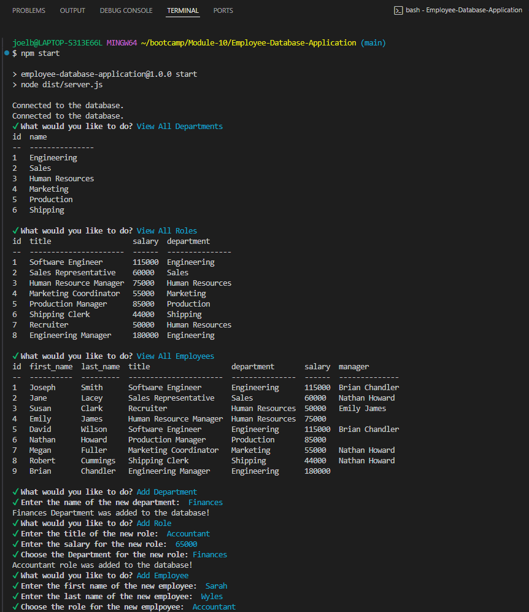

# Employee-Database-Application

  [](https://opensource.org/licenses/MIT)
  
  ## Table of Contents
  
  * [Description](#description)
  * [Installation](#installation)
  * [Usage](#usage)
  * [Contributing](#contributing)
  * [Test](#test)
  * [License](#license)
  * [Questions](#questions)
  
  ## Description
  This is an employee database application that manages employee information that a user can use given a series of command lines.

  ## Installation
  Installation Required:  JavaScript, Node JS, TypeScript `fs`, `pg` and `inquirer` package, and `npm`.

  ## Usage 
  Here is an example screenshot of the Weather Dashboard application:

  [Employee Database Application Video Link](https://drive.google.com/file/d/1hf-K3BImls_JNzbRcdGZIF6C9tz5MF0O/view)

  
  
  ## Contributing
  The source of contributors I have used in this application:
  * Stack Overlow
  * W3School Website
  * Dev Community Website

  
  ## Test 
  Navigate to the filepath of where the code is saved. Type the code below in the terminal, running each line of code separately.

  ```bash
  npm install
  npm install inquirer
  npm install console.table
  ```

  Make sure to set up your `.env` file with the correct database credentials: 

  ``` bash
  DB_USER=your_db_username
  DB_PASSWORD=your_db_password
  DB_NAME=employees_db 
  ``` 

  If `employees_db` database, `schema.sql`, and `seeds.sql` is not setup on your computer, navigate inside the '/db' folder and run these files before running the application.

  ``` bash 
  psql -U postgres 
  ``` 

  ``` bash 
  postgres=# \i schema.sql 
  ``` 

  ``` bash 
  employees_db=# \i seeds.sql 
  ``` 

  Run the Application: 

  ``` bash 
  npm start 
  ``` 


  ## License
  This project is Licensed under the MIT License.
  
  ## Questions
  Feel Free to contact me for any additional questions
  * GitHub: [jbarry89](https://github.com/jbarry89/)
  * Email: myEmail@gmail.com 


